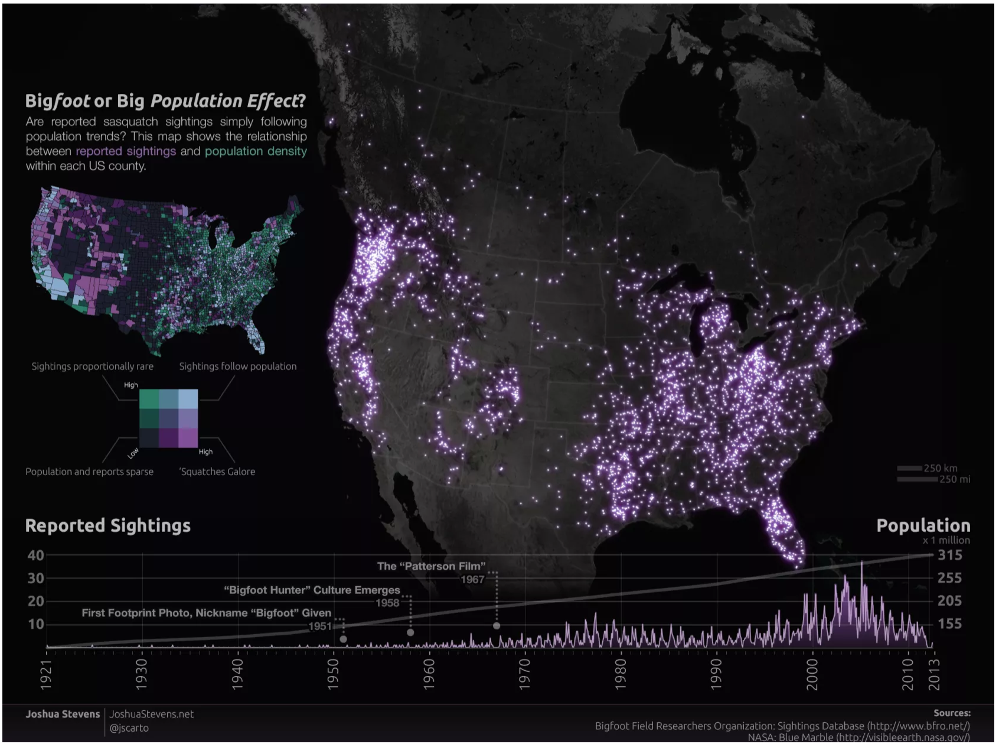

# ShowMeTheSasquatch

Project 2 - Tell a story with data.

Bigfoot Sightings Interactive Dashboard using Plotly

Sources: 
https://timothyrenner.github.io/datascience/2017/08/08/finding-bigfoot-with-dash-part-1.html
http://www.bfro.net/
https://content.nexosis.com/blog/building-the-bigfoot-classinator-getting-started
https://data.world/timothyrenner/bfro-sightings-data

Changes:
Use leaflet instead of Plotly to make nicer maps
Users can zoom in to see where the sightings took place, what the terrain was like, nearby structures, etc.
Use Flask instead of Dash for deployment
Create nicer website using Bootstrap
Tell a better overall story, link to Bigfoot sources, images, etc.
Change csv files to mongo_db
Use flash/dash to deploy to Heroku

## Project Layout Basic Template

## Inspiration

##Group Members: 

Katie Wright, Erin Lampa, Justin Miller, Ricky Ravin, Dave Kingsly

### Task Breakdown:
* Ricky: Flask App, mongo_db
* Erin: HTML, Bootstrap, Readme, dropdown(story page, data page), Marker images
* Katie: Tracing the data, line graph, Heroku Deployment, possible heatmap
* Justin: Visualization (app.js)
* Dave: Visualization (app.js)
